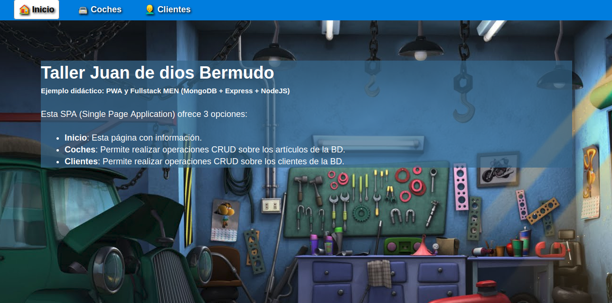
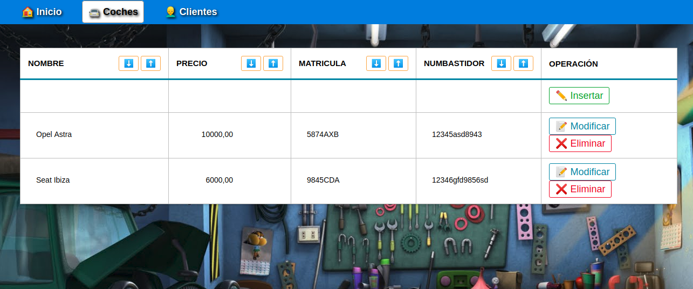
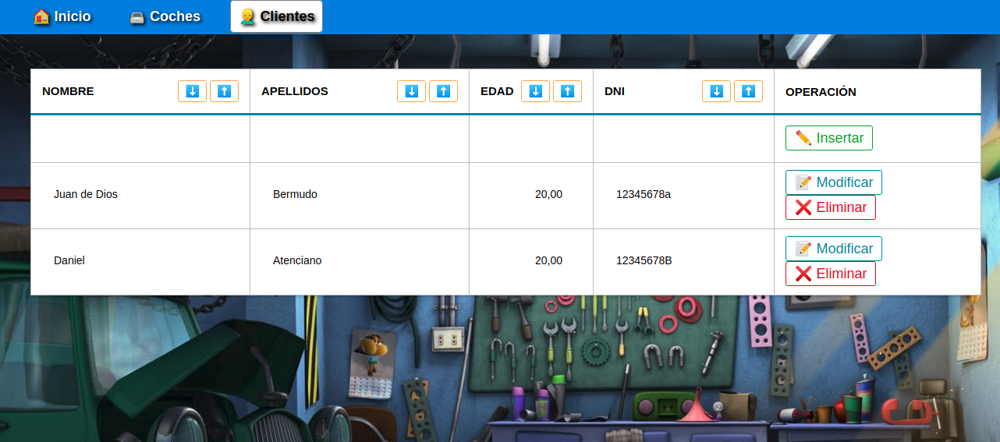

# Taller
PWA + FullStack(MongoDB, Expresss,NodeJS)

## Introducción

Este es un proyecto realizado con fines educativos. Actualmente está desplegado en [Heroku](https://tiendaw.herokuapp.com/).

**BONUS:** La aplicación está desarrollada además como PWA (Progressive Web App). Esto quiere decir que si la abres con Android y pulsas en la opción "Añadir a pantalla de inicio", se te instalará dicha aplicación en tu móvil como si tratará de una aplicación nativa. 

Se utilizan los mínimos recursos (ya sean estos paquetes, librerías o frameworks). Tambien se intenta minimizar el número de archivos utilizados. Este proyecto **NO** necesita de frameworks como Angular, React o Vue para el FrondEnd, ya que hacemos uso de [VanillaJS](http://vanilla-js.com/) ( **~~MEAN~~**, **~~MERN~~**, **~~MEVN~~**  ). 

La interfaz está desarrollada en forma de SPA (Single Page Application).

La interfaz está desarrollada en forma de SPA (Single Page Application).

Los archivos utilizados son los siguientes:

Para el BackEnd los archivos necesarios son:

- package.json
- package-lock.json
- index.js
- config.js
- models.js
- routes.js

Para el FrontEnd los archivos necesarios son:

- public/favicon.png
- public/index.html
- public/style.css
- public/app.js

Para Aplicación Web Progresiva

- public/manifest.json
- public/service-worker.js
- public/images/icons/*
